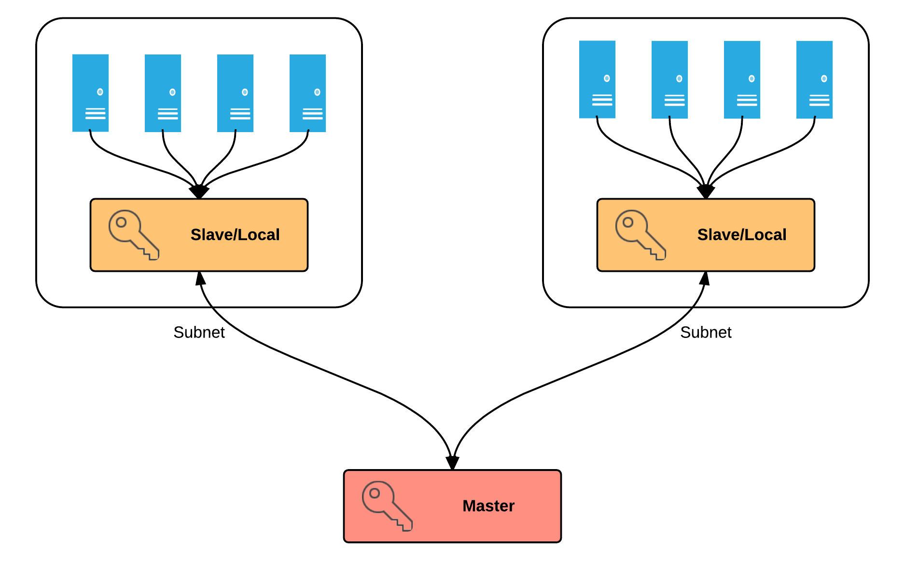
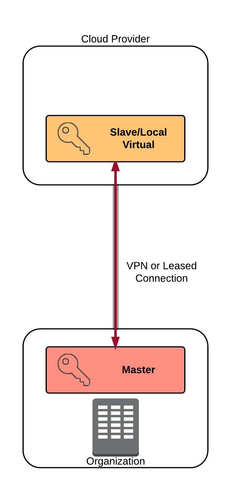

Title: Evolving Encryption Key Management Best Practices for the Data Center

# Data centers and applications are changing; so is key management.

We are in the midst of an IT transformation wave which is likely the most disruptive since we built the first data centers. One that's even more disruptive than the first days of the Internet, due to the convergence of multiple vectors of change. From the architectural disruptions of the cloud, to the underlying process changes of DevOps, to evolving storage practices, to fundamental data center design evolution.

Basic security and compliance requirements now mean data centers are more compartmentalized. Organizations tend to be more distributed, with multiple data centers and applications and services that span them. We see greater demand for central services supporting local implementation; allowing business units more autonomy while still being able to manage costs and support compliance and security requirements.  And that's before we even get into cloud, microservices, and the constantly increasing requirement to encrypt nearly everything.

These are all influencing and changing how we implement encryption in general, and *key management* in particular. While encryption algorithms continue their steady evolution, encryption system *architectures* are being forced to change much faster due to rapid changes in the underlying infrastructure and the applications themselves. 

There is greater demand for encryption in more locations in our data stacks -- which now span physical environments, virtual environments, and increasing barriers even within our traditional environments. Simultaneously, compliance and internal needs also increase the need for compartmentalization and separation of keys, without increasing costs or complexity. Plus, keys must be managed and distributed in ever-more-complex scenarios, such as centralizing enterprise keys while supporting remote business units encrypting storage locally.

This research highlights emerging best practices for managing encryption keys for protecting data at rest in the face of these new challenges. It also presents updated use cases and architectures for the areas where we get the most implementation questions. It is focused on data at rest, including application data.

Some of the best practices we will highlight have long been familiar to anyone responsible for enterprise encryption. Separation of duties, key rotation, and meeting compliance requirements have been on the checklist for a long time. Others are familiar, but have new importance thanks changes occurring in data centers. Providing key management as a service, and dispersing and integrating into required architectures aren't technically new, but they are in much greater demand than before. Then there are the practices which might not make the list if you previously focused on encryption silos, such as supporting interoperability standards, APIs and distributed architectures (potentially spanning physical and virtual appliances).

## How evolving technology and changing practices affect key management

Technology is always changing, but there is a reasonable consensus that the changes we are experiencing now are coming faster than even the early days of the Internet. This is mostly because we see a mix of both architectural and process changes within data centers and applications. 

Enough generalities. Here are the top trends we see impacting data-at-rest encryption, with a few examples:

* **Increased Segmentation:** We are far past the days when flat data center architectures were acceptable. Data centers are increasingly adding internal barriers to improve security, support compliance, or for better managing resources. This affects key management architectures, which now need to support different distribution models without adding management complexity. For example, managing keys for multiple data stores subject to PCI requirements... located on different network segments for different business units.
* **Cloud Computing and Virtualization:** The cloud is the single most disruptive force affecting encryption today. It is driving very large increases in encryption usage, as organizations shift to leverage shared infrastructure. We also see increased *internal* use of encryption due to increased awareness, hybrid cloud deployments, and in preparation for moving data into the cloud. For example, even when you virtualize in your own data center you might need to encrypt the virtual storage using keys the virtualization administrators can't access to enforce segregation of duties, or to keep data isolated from other tenants in shared storage.
* **Outsourcing and Colocation:** Outsourcing isn't anything new, nor is colocating in someone else's data center, but we see increasing moves towards both, and not always as part of a move towards cloud. This means hosting data in multitenant or less-trusted environments. Encrypting the data while still maintaining control of the keys yourself is one of the best ways to keep your data isolated in a shared environment.
* **Microservice architectures:** Application architectures themselves are also becoming more compartmentalized and distributed as we move away from monolithic designs into increasingly distributed, and sometimes ephemeral, services. This again increases demand to distribute and manage keys at wider scale without compromising security. Such as distributing data encryption keys to ephemeral containers.
* **Big Data and NoSQL:** Big data isn't just a catchphrase -- it encompasses a variety of very real new data storage and processing technologies. NoSQL isn't *necessarily* big data, but has influenced other data storage and processing as well. For example, we are now moving massive amounts of data out of relational databases into distributed file-system-based repositories. This further complicates key management, because we need to support distributed data storage and processing on larger data repositories than ever before. That's not necessarily a new challenge for key management itself (any enterprise class tool can handle hundreds or thousands of nodes), except we see greater demand for encryption for these data warehouses, which are often segregated from the rest of the data center (or cloud) due to lack of strong security features in the tools.
* **Containers:** Containers continue the trend of distributing processing and storage (noticing a theme?), on an even more ephemeral basis, where containers might appear in microseconds and disappear in minutes, in response to application and infrastructure demands.
* **DevOps:** To leverage these new changes and increase effectiveness and resiliency, DevOps continues to emerge as a dominant development and operational framework -- not that there is any single definition of DevOps. It is a philosophy and collection of practices that support extremely rapid change and extensive automation. This makes it essential for key management practices to integrate, or teams will simply move forward without support. This often directly translates to providing a responsive key management service to physically or virtually distributed application/development teams that require local control.

These technologies and practices aren't mutually exclusive. It is extremely common today to build a microservices-based application inside containers running at a cloud provider, leveraging NoSQL and Big Data, all managed using DevOps. Encryption may need to support individual application services, containers, virtual machines, and underlying storage, which might connect back to an existing enterprise data center via a hybrid cloud connection.

It isn't always this complex, but sometimes it is. So key management practices are changing to keep pace, so they can provide the right key, at the right time, to the right location, without compromising security, while still supporting traditional technologies.

# Best Practices

If there is one thread tying together all the current trends influencing data centers and how we build applications, it's *distribution*. We have greater demand for encryption in more locations in our application stacks -- which now span physical environments, virtual environments, and increasing barriers even within our traditional environments.

As you will see, the name of the game is consolidation for consistency and control; simultaneous with distribution to support diverse encryption needs, architectures, and project requirements.

But before we jump into recommendations, keep our focus in mind. This research is for enterprise data centers, including virtualization and cloud computing. There are plenty of other encryption use cases out there which don't necessarily require everything we discuss, although you can likely still pick up a few good ideas.

## Build a key management service

Supporting multiple projects with different needs can easily result in a bunch of key management silos using different tools and technologies, which become difficult to support. One for application data, another for databases, another for backup tapes, another for SANs, and possibly even multiple deployments for the same functions, as individual teams pick and choose their own preferred technologies. This results in some common problems:

* Multiple systems to learn and maintain, which increases operational costs.
* Inconsistent auditing and logging.
* Inconsistent implementations and configurations, which increases the complexity in complying with policies/standards.
* Varied management practices and entitlement enforcement.
* Confusion for new projects that need key management, who should be responsible, and where the keys should be stored.

Increasing decentralization only exacerbates these issues, creating a patchwork of key management that can be difficult to keep current and compliant, and that complicates key management for any new projects.

Overall we tend to recommend building centralized security services to support the organization, and this definitely applies to encryption. Let a smaller team of security and product pros manage what they are best at and support everyone else, rather than merely issuing policy requirements that slow down projects or drive them underground. This also increases standardization to reduce cost and complexity, while increasing compliance and auditability.

For this to work the central service needs to be agile and responsive, ideally with internal Service Level Agreements to keep everyone accountable. Projects request encryption support; the team managing the central service determines the best way to integrate, and to meet security and compliance requirements; then they provide access and technical support to make it happen. It should also support central key management with local project control for their keys and settings, if needed. You still gain the advantages of core knowledge, shared resources and costs, and consistent policies while projects and teams maintain the control they require for their needs.

This enables you to consolidate and better manage key management tools, while maintaining security and compliance requirements such as audit and separation of duties. Whatever tool(s) you select clearly need to support your various distributed requirements. The last thing you want to do is centralize but establish processes, tools, and requirements that interfere with projects meeting their own goals. But having a central service can increase security and availability, reduce management overhead for those project teams, and allow them to focus on what they are best at.

## Support industry standards for security and  interoperability

A nifty central key management service is somewhat worthless if it can't manage encryption keys in all the places you need them. There are three major categories of standards to support:

* *Key/encryption standards:* the standard encryption algorithms and their keys, such as AES. This mostly matters when you use a key manager for key generation.
* *Key management/exchange standards:* standards that define how systems exchange and communicate keys, with KMIP and PKCS #11 being the most common (KMIP is more used in key managers, while PKCS #11 for HSMs, but there is a lot of overlap). Other standards, like JCE (Java Cryptography Extension) or Microsoft's CAPI apply to encryption and key management within particular programming languages. 
* *Encryption system/module security standards:* standards that define the security requirements around hardware and software encryption systems. FIPS 140-2 is the most widely used, but remember it has different profiles for different types of systems (hardware vs. software) and four different security levels. Also, FIPS certification may only apply to a component of a system, not the entire thing.

## Centralize but disperse, and support distributed needs

Once you establish a centralized service you need to support distributed access. There are three main options:

* *Allow access from anywhere.* In this model you position the key manager in a location accessible from wherever it might be needed. Typically organizations select this option when they want to only maintain a single key manager (or cluster). It was common in traditional data centers, but isn't well-suited for the kinds of situations we increasingly see today.
* *Distributed clusters.* In this model key management servers are distributed in different physical locations and synchronize data across them. This is the best model for supporting multiple data centers and can also be used within a single segregated data center, if needed. In some cases, you may be able to use a mix of physical and virtual key managers, although we don't recommend running virtual key management appliances on shared hardware (if you can avoid it) due to the potential for memory compromises.
* *Distributed central/local.* In this *emerging* model you maintain a core "root of trust" key manager (which can, again, be a cluster), but then you position distributed key managers which tie back to the central service. These can be a mix of physical and virtual appliances or servers. Typically they only hold the keys for the local application, device, etc. that needs them (especially when using virtual appliances or software on a shared service). Rather than connecting back to complete every key operation, the local key manager handles those while synchronizing keys and configuration back to the central root of trust. Today this tends to be a custom option, not something off the shelf.

Distributed central/local is becoming more common for *application and cloud* while distributed clusters for *storage encryption across data centers* (including multitenant and even some cloud scenarios). For example you could support a virtual appliance in a cloud project, physical appliances in backup data centers, and backup keys used within your cloud provider with their built-in encryption service.

This way you can also support different technologies for distributed projects. The local key manager doesn't necessarily need to be the exact same product as the central one, so long as they can communicate/interoperate and both meet your security and compliance requirements. We have seen architectures where the central service is a key management cluster, while the local service is software holding keys for a microservice architecture based application.  This lets you leverage your key manager(s) for more-traditional scenarios like disk, tape, and server encryption, while still providing backup and centralization of keys for a cloud-based application.

*Author's note... need to complete and insert a diagram here.*

The biggest potential obstacle to any distributed encryption model (especially when cloud and virtualization are involved) is providing safe, secure access back to the core. Architecturally you can usually manage this with some bastion systems and/or encrypted tunnels to support key exchange, without opening the core to the Internet. There may still be use cases where you cannot tie everything together, but that should be your last option.

## Be flexible: use the right tool for the right job

Building on our previous recommendation, you don't need to force every project to use a single tool. One of the great things about key management is that modern systems support a number of standards for intercommunication. And when you get down to it, an encryption key is merely a chunk of text -- not even a very large one.

With encryption systems, keys and the encryption engine don't need to be the same product. Even your remote key manager doesn't need to be the same as the central service if you need something different for that particular project.

We have seen large encryption projects fail because they tried to shoehorn everything into a single monolithic stack. You can increase your chances for success by allowing some flexibility in remote tools, so long as they meet your security requirements. This is especially true for the encryption engines that perform actual crypto operations.

## Provide templates and recommendations, not just standards and requirements

All too often security sends out requirements, but fails to provide specific instructions for meeting those requirements. One of the advantages of standardization around a smaller set of tools is that you can provide detailed recommendations, instructions, and templates to satisfy requirements.

The more detail you can provide the better. We recommend literally creating instructional documents for how to use all approved tools, likely with screenshots, to meet encryption needs and integrate with your key management service. Make them easily available, perhaps through code repositories to better support application developers. On the operations side, include them not only for programming and APIs, but for software agents and integration into supported storage repositories and backup systems.

If a project comes up which doesn't fit any existing toolkit or recommendations, build them with that project team and add the new guidance to your central repository. This dramatically speeds up encryption initiatives for existing and new platforms.

## Meet core security requirements

So far we have focused on newer requirements to meet evolving data center architectures, the impact of the cloud, and new application design patterns; but all the old key management practices still apply:

* Enforce separation of duties: Implement multiple levels of administrators. Ideally require dual authorities for operations directly impacting key security and other major administrative functions.
* Support key rotation: Ideally key rotation shouldn't create downtime. This typically requires both support in the key manager and configuration within encryption engines and agents.
* Enable usage logs for audit, including purpose codes: Logs may be required for compliance, but are also key for security. Purpose codes tell you why a key was requested, not just by who or when.
* Support standards: Whatever you use for key management must support both major encryption standards and key exchange/management standards. Don't rely on fully proprietary systems that will overly limit your choices.
* Understand the role of FIPS and its different flavors, and ensure you meet your requirements: FIPS 140-2 is the most commonly accepted standard for cryptographic modules and systems. Many products advertise FIPS compliance (which is often a requirement for other compliance, such as PCI). But FIPS is a graded standard with different levels ranging from a software module, to plugin cards, to a fully tamper-resistant dedicated appliance. Understand your FIPS requirements, and if you evaluate a "FIPS certified" 'appliance', don't assume the *entire* appliance is certified -- it might be only the software, not the whole system. You may not always need the highest level of assurance, but start by understanding your requirements, and then ensure your tool actually meets them.

## For application data encryption, provide APIs, SDKs, and toolkits

When supporting custom application development, even off-the-shelf encryption engines sometimes ship with less than ideal defaults, and can easily be used incorrectly. Application encryption is beyond the scope of this report, but is often integrated with central key management. Building a key management service for application isn't merely creating a central key manager -- you also need to provide hooks to support projects, along with processes and guidance to ensure they are able to get up and running quickly and securely.

* *Application Programming Interfaces:* Most key management tools already support APIs, and this should be a selection requirement. Make sure you support RESTful APIs, which are particularly ubiquitous in the cloud and containers. SOAP APIs are considered burdensome these days.
* *Software Development Kits:* SDKs are pre-built code modules that allow rapid integration into custom applications. Provide SDKs for common programming languages compatible with your key management service/products. If possible you can even pre-configure them to meet your encryption requirements and integrate with your service.
* *Toolkits:* A toolkit includes all the technical pieces a team needs to get started. It can include SDKs, preconfigured software agents, configuration files, and anything else a project might need to integrate encryption into anyything from a new application to an old tape backup system.

There are many more technical best practices beyond the scope of this research, but the core advice that might differ from what you have seen in the past is:

* Provide key management as a service to meet diverse encryption needs.
* Be able to support distributed architectures and a range of use cases.
* Be flexible on tool choice, then provide technical components and clear guidance on how to properly use tools and integrate them into your key management program.
* Don't neglect core security requirements.

In our next section we will start looking at specific use cases, some of which we have already hinted at.

# Use Cases

Now that we've talked about the best practices, it's time to transition and cover common use cases. Well, mostly common; since one of our goals in this research is to highlight emerging practices a couple of our use cases cover newer data-at-rest key management scenarios, while the rest are more-traditional options.

## Single Data Center

There are three major types of data at rest storage we commonly see encrypted in traditional data centers: SAN/NAS, backup tapes, and databases. On occasion we also see file servers, but those are in the minority. Each of these is handled slightly differently, but there are two "meta-architectures" most commonly used:

* *Silos*. Some storage tools include their own encryption capabilities, managed with the silo of the application/storage stack. For example, a backup tape system with built-in encryption. The keys are managed by the tool within its own stack. In this case an external key manager isn't used, and thus can lead to some risk of application dependencies and key loss unless it's a really well designed product.
* *Centralized key management*. Instead of managing the keys locally, a central, dedicated key management tool is used. In many cases organizations start with silos and then integrate those tools with central key management for advantages like better separation of duties, security, audit, and portability. Thanks to increasing support for [KMIP and the PKCS #11 standards](https://en.wikipedia.org/wiki/Key_Management_Interoperability_Protocol) many major products are now able to communicate key management functions and key exchanges.

Each of those meta-architectures can handle managing keys for any of the storage options we see (assuming the tools are compatible), even using different products. The encryption engine doesn't need to be part of the same tool as the key manager as long as both are able to communicate.

And that's the clincher in terms of requirements, and the biggest potential obstacle to a well-compartmentalized data center implementation — the key manager and the encryption engines not only need to speak the same language, they need a network connection with acceptable performance that crosses security boundaries. This will often define the physical and logical location of the key manager, and may require additional distribution even within a single data center using multiple key managers. Also, there is *never a single key manager*. You need more than one for availability, in either a cluster or hot standby relationship.

## Geographically Distributed Data Centers (including hosted/co-location)

It's been a long time since organizations ran in single data centers; most of you likely manage assets in multiple locations, although some of those might included rented space in a colocation or hosted facility.

When your encryption spans these boundaries so does your centralized key management. This is where the distributed architectures become even more important.

*Distributed key management* is very common when there are multiple data centers either sharing information or used for disaster recovery (e.g. a hot standby site). While you can technically route everything to a single key manager this, like any single point of failure, is a recipe for disaster. Enterprise-class key management products can synchronize keys between multiple key managers. Remote storage tools should connect to the key manager in their same physical location to avoid WAN network dependencies. The biggest issue with this design is typically ensuring the different locations synchronize quickly enough, which tends to be more an issue for distributed applications balanced across locations than it is for a hot standby site where data changes aren't happening on both sides simultaneously. Another important issue is making sure you can centralize manage the distributed deployment instead of having to log into everything separately.

Your key management system(s) should support central management and consistent configurations, otherwise you are basically creating geographic silos that are difficult to manage. This model also works well even if you are co-locating in someone else's data center, assuming you can maintain control of your key management hardware and software. For those scenarios make sure you can properly remotely manage the tools, which may include requirements for physical access in worst-case scenarios.

### Hybrid Cloud/Virtualization

This model extends the geographic distribution into a cloud or virtual environment where you not only don't necessarily control the hardware, but you may also be sharing resources with other tenants. 

The fundamental models are the same, except your security or product requirements may limit your ability (or desire) to deploy any key management components in the cloud. We see organizations taking four approaches:

* *Silo*. you deploy some sort of key management specific to the cloud or virtual environment that is separate from the rest of your operations.
* *Deploy a key manager in the cloud/virtual data center*. This option is more common for co-located or hosted private clouds where you can insert your own security hardware and servers into the environment. You basically treat it like one of your own data centers. This clearly won't work for any public cloud/IaaS services.
* *Tunnel traffic back to an on-premise key manager.* This is more common for data storage and other low-velocity encryption scenarios where you don't need offline or high-volume transactions where latency could become an issue in the cloud. It also reduces the need to deploy anything in the cloud or virtual environment, you handle it with VPN or dedicated tunnels backhauls to the data center and treat it like any other subnet.
* *Distribute key management into the cloud/virtual network*. In this case you deploy a key manager into the cloud or virtual network, which you link into your distributed cluster. It may need to be a custom solution if you only want to distribute a subset of keys to the cloud, depending on your tool support, as we previously discussed. This option is more common in application encryption scenarios where you still want to use the centralized key manager as a root of trust.

## Application Support

There are as many different ways to encrypt an application as there are developers in the world (just ask them). That said, we once again tend to see most organizations coalescing around a smaller set of options:

* *Custom*. Developers program their own encryption (often using common encryption libraries) and design and implement their own key management. These are rarely standards-based and can become problematic if you late need to add key rotation, audit, or other security or compliance features. 
* *Custom with external key management*. The encryption itself is, again, custom programmed but instead of handling key management itself, the application communicates with a central key manager, usually using an API. Architecturally the key manager needs to be relatively close to the application server to reduce latency, depending on the particulars of how the application is programmed. Also, security is obviously closely tied to how well the application is programmed.
* *Key manager software agent or SDK*. This is the same architecture, but in this case the application uses a software agent or pre-configured SDK provided with the key manager. This is a great option since it often reduces common errors in building encryption systems and *should* speed up integration and offer more features and easier management. Well, assuming everything works as advertised.
* *Key manager-based encryption*. That's an awkward way of saying that instead of providing the encryption keys to the application, the application provides the data to the key manager and gets encrypted data in return. 

We deliberately skipped file and database encryption, since those are variants of our "traditional data center storage" category, but we do see both integrated into different application architectures. 

Based on our client work (in other words, a lot of anecdotes), application encryption seems to be the fastest growing option. It's also agnostic as to your data center architecture, assuming the application can reach the key manager with adequate performance. It doesn't really care if it's in the cloud, on premise, or in a hybrid cloud deployment.

### Hybrid Cloud for Applications

Speaking of hybrid cloud, after application encryption (usually in cloud deployments) this is where we see the most questions. There are two main use cases:

* *Extending existing key management to the cloud*. Many organizations already have a key manager they are happy with. As they move into the cloud they may either want to maintain consistency by using the same product, or need to support a migrating application without having to gut the key management to build something new. One approach is to always call back over the network to the on-premise key manager. This reduces the need for architectural changes (or additional licenses), but often runs into latency and performance issues (even with a direct network connection). Alternatively you can deploy a virtual appliance version of the key manager as a "bastion" host and synchronize the keys so assets in the cloud connect to the distributed virtual server for better performance.
* *Building a root of trust for cloud deployments*. Even when you are fully comfortable deploying your key manager in the cloud, you may still want an on-premise key manager to retain backups of keys or support interoperability across cloud providers.

Generally you will want a virtual version of the key manager running within the cloud to meet performance needs, even though you can technically route all requests back to the data center. It's still really important to synchronize the keys, backups, and even logs back on-premise or to multiple, distributed cloud-based key managers since no single instance/virtual machine is ever reliable.

## Bring Your Own Key

This is a very new option in some cloud providers that allows you to use an encryption service/product within the cloud, but keep ownership of your keys. For example, you provide your own file encryption key to the cloud provider who then uses it to encrypt your data, instead of using a provider-managed key.

The name of the game here is "proprietary". Each cloud provider has different ways of supporting customer managed keys. You nearly always need to meet stringent network and location requirements if you want to host the key manager yourself, or you need to use the cloud provider's key management service configured so you manage the keys yourself. 

# Conclusion: It's About Distribution and Segregation

Where we build, deploy, and maintain the applications and services that run our organizations not only looks different than a decade or two ago, but continues to evolve at a tremendous rate. Data centers are far more distributed across the physical and virtual world. Interior walls continue to grow to help meet performance, security, and compliance requirements. We are adopting new patterns, such as letting business units manage more of their own assets, to meet increasing agility pressures to stay competitive.

Encryption is one of the security linchpins that spans our IT deployments, and is central to keeping us compliant, maintaining proper separation of duties, enforcing security, and providing the artifacts to keep auditors happy. 

Centralizing key management isn't the only option, but it is increasingly the right one. Silos of encryption are difficult to manage properly at scale, especially for regulated data. Silos used to be the only option due to lack of interoperability,  but industry standards like KMIP and others have reduced that friction and were created directly from user requests to centralize and integrate key management. 

Our recommendation is to build out a central key management service to support your organization. One that supports distributed data centers, compartmentalized networks, and supports different security contexts for logical segregation. You might still need a silo, but it's best to start with a central, secure, compliant, system with good auditing that can be consistently managed. 

